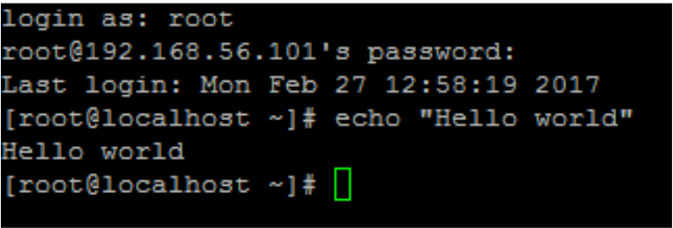
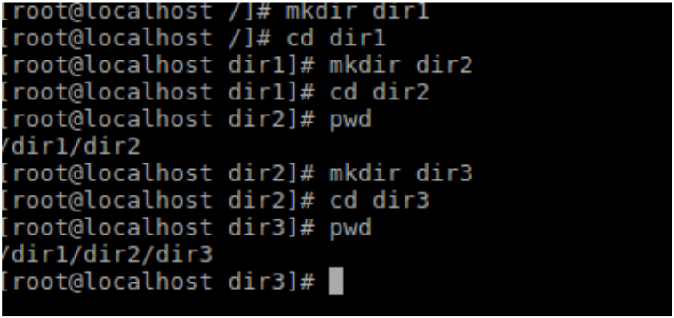
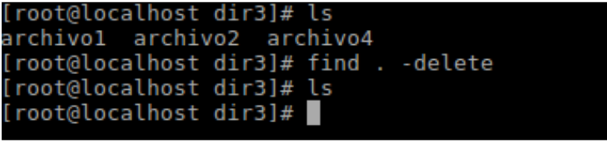
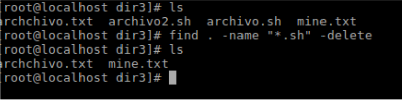
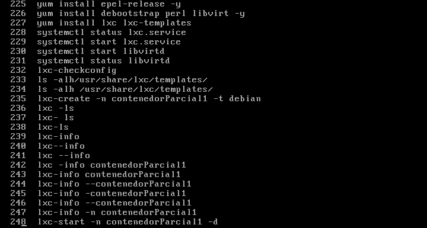
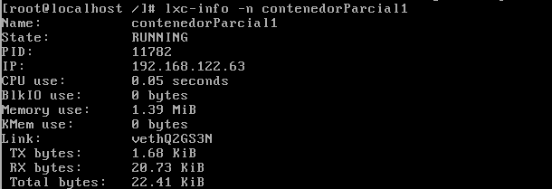
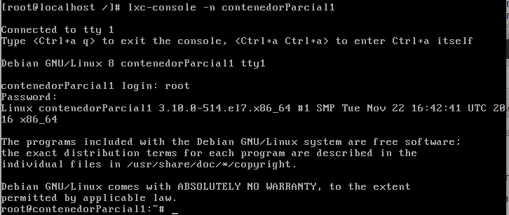

Jorge Arturo Hernandez MUñoz
A00317220

**1. Resolver 5 retos de la pagina https://cmdchallenge.com
Los 5 retos que seleccione fueron los siguientes:

(Todas las imagenes de funcionamiento en el pdf que se encuenta en este repositorio)

  a. Hello world:
  La solución a este reto es escribir el comando echo "Hello world"
  
  
     
  b. CUrrent_working_directory
     Este reto nos permite saber en que directorio estamos trabajando.
     La solución a este reto es escribir el comando pwd.
     
     
     
  c. list_files
     El reto es listar que archivos hay en un directorio.
     La solucion a este reto es escribir el comando ls.
     
    

  d. delete_files
     El reto es borrar todos los archivos que estan ubicados en un directorio con un solo comando.
     La solución a este reto es escribir el comando find . -delete
     
    
     
  e. Remove_files_with_extension
     El reto es borrar todos los archivos que estan ubicados en un directorio con una determinada extension.
     La solución a este reto es escribir el comando find . -name "*.Extension del archivo" -delete
     
     
     

**  2. Realice un script que a partir de un listado con no menos de dos direcciones ips, descargue en forma remota un libro del 
     proyecto www.gutenberg.org

     Script:
     spawn ssh operativo@192.168.130.20

expect "operativo@192.168.130.20's password:"
send "operativos\r"
expect "$"
send "cd /tmp\r"
expect "$"
send  "wget http://www.gutenberg.org/cache/epub/54247/pg54247.txt\r"

expect "$"
send "exit\r"
expect eof

        spawn ssh operativos@192.168.130.15
        expect "operativos@9192.168.130.15's password:"
        send "operativos\r"
        expect "$"
        send "cd /tmp\r"
        expect "$"
        send "wget http://www.gutenberg.org/cache/epub/54247/pg54247.txt\r"

expect eof

**Prueba de funcionamiento uno**

**Prueba de funcionamiento dos**

**3. Montar un contenedor con lxc 
  Lo primero que se hizo fue instalar lxc y todas las librerias necesarias.
  

  
**  Para la verifcación se hicieron 2 cosas:
 ** primero se verifico que el contenedor estuviera corriendo  
 
 
  
  Luego que dentro de este se pudieran ingresar comandos.
 
 

### referencias :  

**Url de mi github : https://github.com/GeorgeArturo/so-exam1

   
    
   
   
   
    
      
